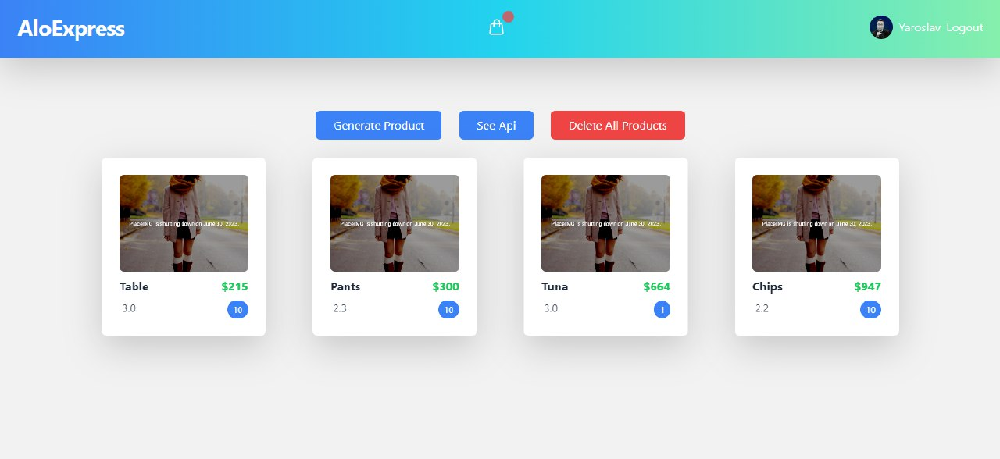

# MSHP_2035 - AloExpress

Welcome to the MSHP_2035 project, AloExpress! This project is a full-stack web application designed to be a shop platform. It utilizes a variety of tools and technologies in order to provide a seamless, modern shopping experience. 

## Tech Stack

In this project, we used a variety of technologies and tools to bring it to life. These tools are broken down into two categories: Backend and Frontend.

| Backend                                                                        | Frontend                                                            |
| ----------------------------------------------------------------------------- | ------------------------------------------------------------------- |
|  |                         |
|    |            |
|      |                |
|      |                       |
|   |                         |
|            |                    |
|         |                           |
|    |                           |
|    |                                 |
|      |                     |
|       |  |
|               |                           |
|                                                                                        |                    |
|                                                                                        |                    |
|                                                                                        |                    |

## Getting Started

To run this project on your local machine, follow these simple steps:

1. Clone the repository to your local machine using `git clone https://github.com/ElonMusk2002/MSHP_2035.git`
2. Navigate to the backend folder with `cd backend`
3. Install the necessary backend dependencies with `npm install`
4. Begin the backend build process with `npm run build`
5. Navigate to the frontend folder with `cd ../frontend`
6. Install the necessary frontend dependencies with `npm install`
7. Run the frontend development server with `npm run dev`
8. Paste your MongoDB url into the `.env` file to connect the database
9. Provide firebase configurations to enable Google authentication

## Thank you!

I'd like to extend a big thank you to [Rewive](https://github.com/Rewive), for helping me with this project. 

## Features

Here are some key features of AloExpress:

- User authentication and authorization using Firebase and JSON Web Tokens
- Seamless integration with MongoDB for data storage
- A user-friendly shopping experience with product filtering
- User reviews and ratings for products
- Responsive design for both desktop and mobile devices

We're always working on adding new features and improving the existing ones, so stay tuned for updates!

## Contributions

We welcome contributions from anyone who is interested in improving AloExpress. If you'd like to contribute, please follow these steps:

1. Fork the repository on GitHub
2. Clone the forked repository to your local machine
3. Create a new branch for your changes with `git checkout -b my-feature-branch`
4. Make your changes and commit them with descriptive messages
5. Push your changes to your forked repository with `git push origin my-feature-branch`
6. Create a pull request on GitHub and describe your changes in detail
7. Wait for the maintainers to review your changes and merge them into the main branch

Thanks for your interest in contributing to AloExpress!

## License

This project is licensed under the MIT License.

