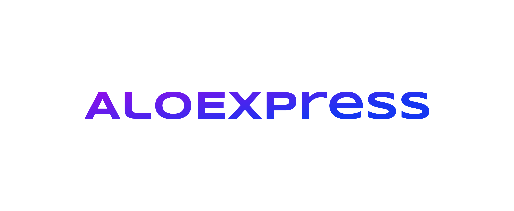

# 👋 Welcome to the MSHP_2035 project, AloExpress! 

This is a full-stack web application designed to be a shop platform. With the help of various modern tools and technologies, AloExpress provides a seamless and modern shopping experience. 

## 👨‍💻 Team

This project is a collaborative effort by two developers - Me and Ivan Lopatin. Check out Ivan's GitHub profile at [Rewive](https://github.com/Rewive).

## 🚀 Demo

## Note! 

The GIF offers a glimpse into the project's early stages, we're excited to share that several improvements and changes have been made since then. For a comprehensive overview of all the updates, make sure to explore our releases section.

## 🛠️ Tech Stack

AloExpress utilizes a variety of technologies and tools to provide the best possible shopping experience. These tools are broken down into two categories: Backend and Frontend.

| Backend                                                                                 | Frontend                                                                                       |
| -------------------------------------------------------------------------------------- | ---------------------------------------------------------------------------------------------- |
|  |                              |
|   |                 |
|   |                     |
|   |                              |
|  |                              |
|              |                      |
|  |                              |
|  |                                |
|  |                          |
|      |            |
|  |         |
|           |                                  |
|                                                                                          |                      |
|                                                                                          |                  |
|                                                                                          |     |

## 🏁 Getting Started

To run AloExpress on your local machine, follow these simple steps:

1. Clone the repository to your local machine using `git clone https://github.com/ElonMusk2002/MSHP_2035.git`.
2. Navigate to the backend folder with `cd backend`.
3. Install the necessary backend dependencies with `npm install`.
4. Begin the backend build process with `npm run build`.
5. Navigate to the frontend folder with `cd ../frontend`.
6. Install the necessary frontend dependencies with `npm install`.
7. Run the frontend development server with `npm run dev`.
8. Paste your MongoDB url into the `.env` file to connect the database.
9. Provide Firebase configurations to enable Google authentication.

## 💡 Features

Here are some key features of AloExpress:

- User authentication and authorization using Firebase and JSON Web Tokens
- Seamless integration with MongoDB for data storage
- A user-friendly shopping experience with product filtering
- User reviews and ratings for products
- Responsive design for both desktop and mobile devices

We're always working on adding new features and improving the existing ones, so stay tuned for updates!

## 🤝 Contributions

We welcome contributions from anyone who is interested in improving AloExpress. If you'd like to contribute, follow these steps:
1. Fork the repository on GitHub.
2. Clone the forked repository to your local machine.
3. Create a new branch for your changes with `git checkout -b my-feature-branch`.
4. Make your changes and commit them with descriptive messages.
5. Push your changes to your forked repository with `git push origin my-feature-branch`.
6. Create a pull request on GitHub and describe your changes in detail.
7. Wait for the maintainers to review your changes and merge them into the main branch.

Thanks for your interest in contributing to AloExpress!

## 📝 License

This project is licensed under the MIT License.

## ⭐️ Support

If you find this project helpful, please consider leaving a star!

🎉 Thank you for your support! 🎉

